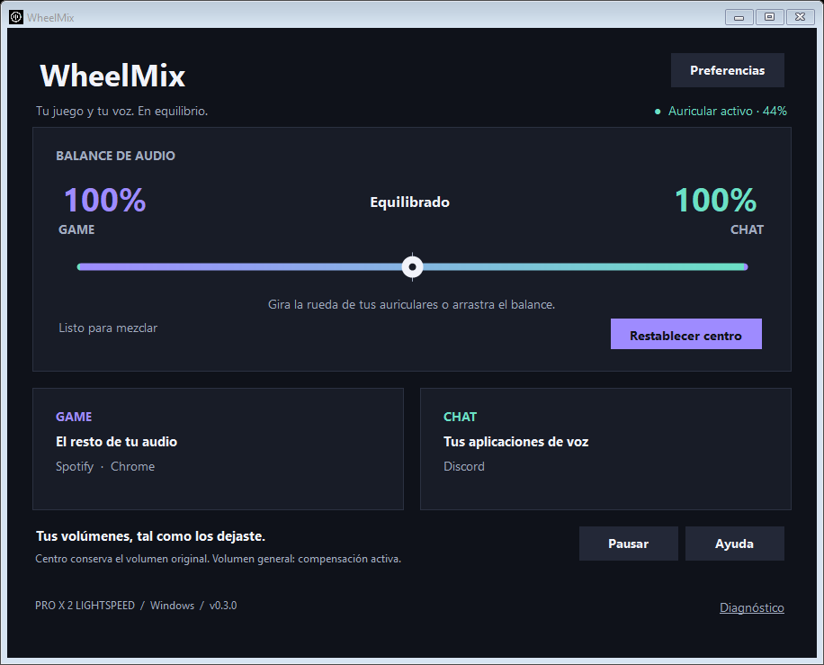
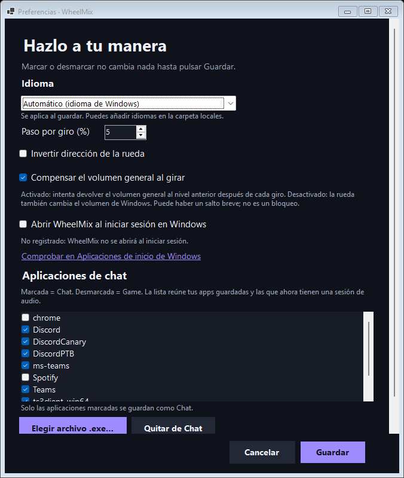
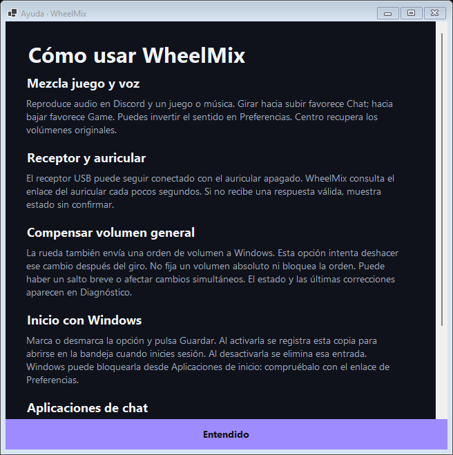

<h1 align="center">WheelMix</h1>

<b>Tu juego y tu voz. En equilibrio.</b> 
Convierte la rueda de volumen de tus Logitech PRO X 2 LIGHTSPEED en un mezclador Game / Chat para Windows.

<a href="README.md">Read in English</a>

WheelMix es un **ChatMix gratuito y de código abierto para los auriculares Logitech PRO X 2 LIGHTSPEED**. Gira la rueda de volumen del auricular y baja el juego mientras Discord (o Teams, TeamSpeak, Zoom…) sigue alto, o al revés. Usa el mezclador de volumen normal de Windows: sin SteelSeries GG, sin dispositivos de audio virtuales, sin controladores, y G HUB puede seguir abierto.

## Descargar

1. Entra en [**Releases**](https://github.com/Markuus9/wheelmix-prox2/releases/latest) y descarga `WheelMix-vX.Y.Z-win-x64.zip`.
2. Extrae el ZIP en una carpeta que vayas a conservar (por ejemplo `Documentos\WheelMix`).
3. Ejecuta **WheelMix.exe**. Es portable: incluye .NET y no instala nada.
4. Conecta el receptor USB de los PRO X 2, abre Discord y un juego, y gira la rueda.

> El ejecutable todavía no está firmado, así que Windows SmartScreen puede avisar la primera vez. Pulsa **Más información › Ejecutar de todas formas**. Puedes comprobar la descarga con el archivo `.sha256` de cada release.

## Qué puedes hacer

- **Mezclar con la rueda**: hacia arriba favorece Chat y hacia abajo Game. También puedes arrastrar el balance en pantalla.
- **El centro conserva tus volúmenes**: el balance es relativo al nivel de cada app; si Spotify estaba al 40 %, sigue al 40 %.
- **Funciona en segundo plano**: cerrar la ventana deja WheelMix en el área de notificación (iconos ocultos). **Salir** desde su icono la cierra del todo.
- **Inicio con Windows** si lo activas en Preferencias. Aparece como *WheelMix* en Configuración › Aplicaciones › Inicio.
- **Tus apps de chat**: Discord, Teams, TeamSpeak y Zoom vienen incluidas; puedes añadir cualquier `.exe`.
- **Estado y batería del auricular**, pausa, dirección inversa y tamaño de paso.
- **13 idiomas**, seleccionables en Preferencias › Idioma. [Añade el tuyo](locales/README.md).

## Capturas

| Preferencias | Ayuda |
|---|---|
|  |  |

## Límites

- Windows 10/11 x64 con los PRO X 2 LIGHTSPEED por receptor USB. Bluetooth, analógico y otros auriculares no están validados.
- La compensación del volumen general es de mejor esfuerzo: puede haber un salto breve o aparecer el indicador de volumen de Windows.
- Las pestañas del navegador comparten proceso y no se pueden separar; usa Discord de escritorio.
- Al salir normalmente se restauran los volúmenes. Si se fuerza el cierre, recupéralos en el mezclador de Windows.

No está afiliado a Logitech ni a SteelSeries. Sin telemetría. Configuración y registros en `%LOCALAPPDATA%\ControlAudioLogitech\`.

Para compilar, contribuir o conocer los detalles técnicos, consulta el [README en inglés](README.md) y [CONTRIBUTING.md](CONTRIBUTING.md). Licencia [MIT](LICENSE).
