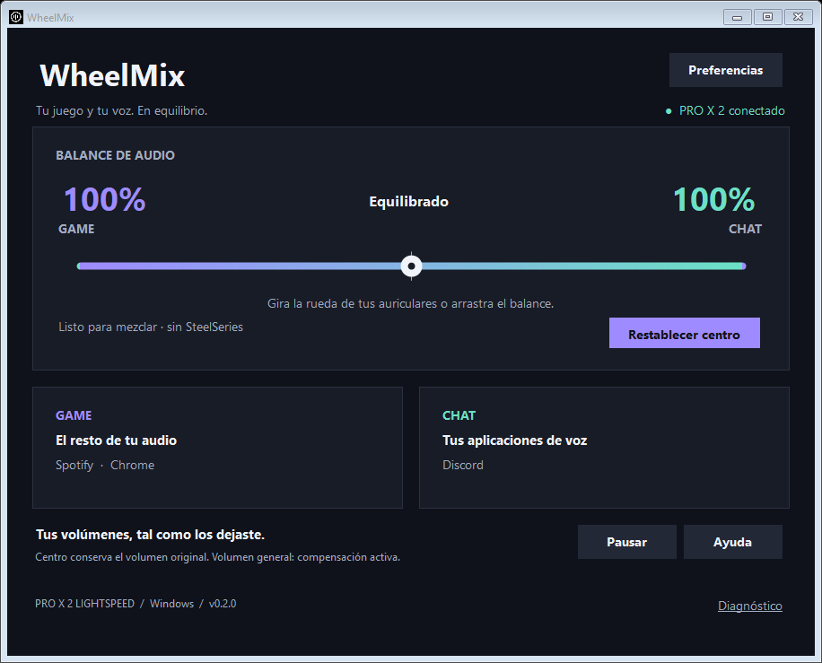

# WheelMix

**Tu juego y tu voz. En equilibrio.**

Convierte la rueda de tus Logitech PRO X 2 LIGHTSPEED en un control de balance entre Discord y el resto del audio. Funciona con el mezclador de Windows, sin SteelSeries y sin instalar controladores.



*Vista de la interfaz con aplicaciones de ejemplo. UI actualmente en español.*

## Descargar y usar

1. En la sección **Releases** del repositorio, descarga `WheelMix-v0.2.0-win-x64.zip` cuando esté publicado.
2. Extrae el ZIP y ejecuta **WheelMix.exe**.
3. Conecta el receptor USB de los PRO X 2 y abre Discord y tu juego.
4. Gira la rueda para dar prioridad al chat o al juego.

La descarga portátil incluye .NET. No necesita instalación, una cuenta, permisos de administrador ni SteelSeries. El proyecto está preparado para publicar; no presupone que ya exista una release pública.

## Lo que puedes hacer

- Mezclar Game y Chat con la rueda o con el balance de la pantalla.
- Ver las aplicaciones de voz y el resto del audio por separado.
- Recuperar el volumen original con **Restablecer centro**.
- Cambiar el paso, invertir la dirección y elegir tus aplicaciones de chat.
- Pausar la mezcla y devolver la rueda a su función de volumen.
- Minimizar a la bandeja e iniciar con Windows, si lo activas.
- Abrir diagnósticos aparte cuando necesites resolver un problema.

Discord, Discord PTB/Canary, Teams, TeamSpeak y Zoom están incluidos en la lista inicial de chat. El resto de sesiones de aplicaciones se consideran Game; los sonidos del sistema se omiten.

## Cómo funciona

WheelMix identifica los informes HID del receptor `046D:0AF7`, colección Consumer Control `000C:0001`. No intercepta globalmente las teclas del teclado.

En modo Windows regula el volumen de las sesiones de las aplicaciones en sus salidas actuales. **No crea dos dispositivos virtuales.**

| Balance | Game | Chat |
|---|---:|---:|
| Todo Game | 100 % | 0 % |
| Centro | 100 % | 100 % |
| Todo Chat | 0 % | 100 % |

Los porcentajes son relativos al volumen original de cada aplicación. Si Spotify estaba al 40 %, el centro lo conserva al 40 %.

## Compatibilidad y límites

- Windows 10/11 x64 y Logitech PRO X 2 LIGHTSPEED mediante receptor USB.
- Bluetooth, conexión analógica y otros auriculares no se han validado.
- El control por aplicación necesita audio compartido de Windows; el modo exclusivo no está cubierto.
- Las pestañas de navegador que comparten proceso no pueden separarse por contenido. Es preferible Discord de escritorio.
- La compensación **Mantener el volumen general** está activa por defecto en instalaciones nuevas. Restaura el volumen después del giro; puede haber un salto breve, aparecer el indicador de Windows o interferir con cambios simultáneos. Es una compensación de mejor esfuerzo, no un bloqueo HID. Se puede desactivar.
- Al cerrar normalmente se restauran los niveles de las sesiones. Un cierre forzado puede dejar niveles atenuados: recupéralos en el mezclador de Windows.
- La versión no está firmada digitalmente. No se garantiza que Windows SmartScreen la reconozca.
- La integración opcional de Sonar sigue disponible en Preferencias. Usa una API comunitaria no oficial; no se validó contra un servicio Sonar operativo en este equipo.

No está afiliado a Logitech ni a SteelSeries.

## Compilar

Necesitas Windows x64 y un SDK .NET 8 compatible con `global.json`. El proyecto fija el runtime de distribución y sus dependencias.

```powershell
./build.ps1
```

El script restaura con el archivo de bloqueo, publica el ejecutable autónomo, ejecuta las pruebas de lógica y API simulada y genera:

- `release/WheelMix-win-x64/WheelMix.exe`
- `release/WheelMix-v0.2.0-win-x64.zip`
- Su archivo `.sha256`.

No distribuyas `bin/`, logs ni el ZIP antiguo del prototipo. El paquete para usuarios es el ZIP generado dentro de `release/`.

## Pruebas

El build ejecuta las 15 comprobaciones de lógica y contratos HTTP. También hay una prueba local de audio real:

```powershell
Start-Process ./release/WheelMix-win-x64/WheelMix.exe -ArgumentList '--test-windows' -Wait
```

Cierra WheelMix antes de ejecutarla. Crea una sesión silenciosa y solo cambia el volumen de su propio proceso. Comprueba silencio, 50 % y restauración.

Más pruebas y criterios manuales en [Testing](docs/TESTING.md). El flujo CI compila y prueba sin requerir auriculares. No sustituye las pruebas físicas.

## Publicar en GitHub

Sube el código fuente, los assets y `.github/`. El flujo incluido genera el ZIP y su hash como artefactos en cada push, PR o ejecución manual. **No publica releases automáticamente.**

Para una release: comprueba los criterios de [publicación](docs/RELEASING.md), crea una etiqueta y adjunta el ZIP y su hash a la release correspondiente. No hay credenciales ni nombres de cuenta preconfigurados.

## Datos y desinstalación

Configuración y registros: `%LOCALAPPDATA%/ControlAudioLogitech/`. No hay telemetría ni actualización automática. El modo Windows no hace conexiones de red; Sonar solo se conecta al equipo local. Los logs incluyen procesos y rutas HID: revísalos antes de compartirlos.

Para quitar la app, desactiva **Iniciar al entrar en Windows**, cierra WheelMix y elimina su carpeta. Puedes borrar también la carpeta local de configuración. La interfaz ayuda a mantener la entrada de inicio, pero mover el ejecutable requiere desactivar y volver a activar esa opción.

Código bajo licencia [MIT](LICENSE). NAudio y los componentes .NET conservan sus propias licencias, incluidas en la descarga.

## English

WheelMix turns the Logitech PRO X 2 LIGHTSPEED headset wheel into a game/voice balance control using Windows audio sessions. Download the portable Windows x64 ZIP, extract it, and run WheelMix.exe. It bundles .NET and does not require SteelSeries or virtual audio drivers.

The interface is currently Spanish. See [Quick start](QUICKSTART.md) for the English control guide. System-volume compensation is best effort, not a guaranteed input block. This release is unsigned.
